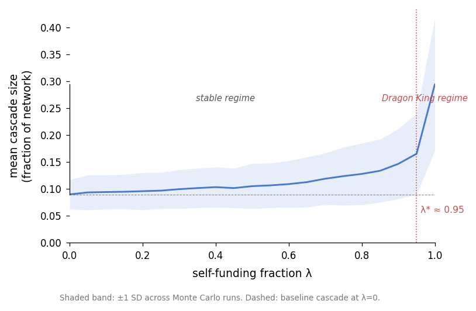
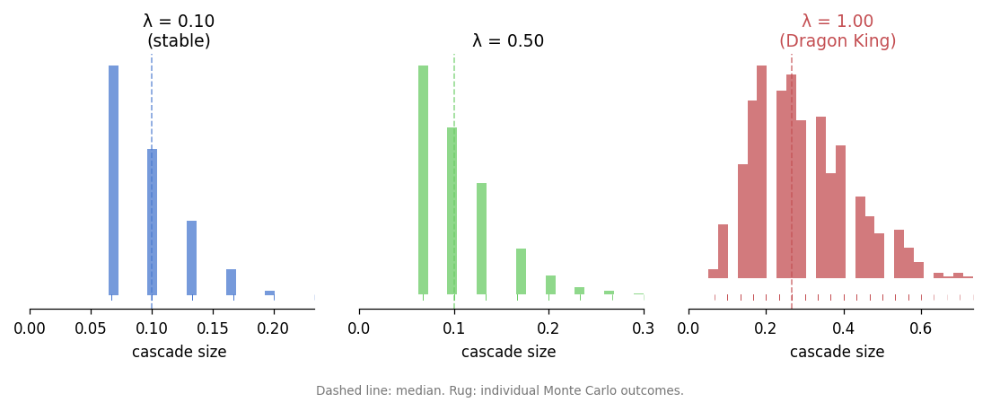
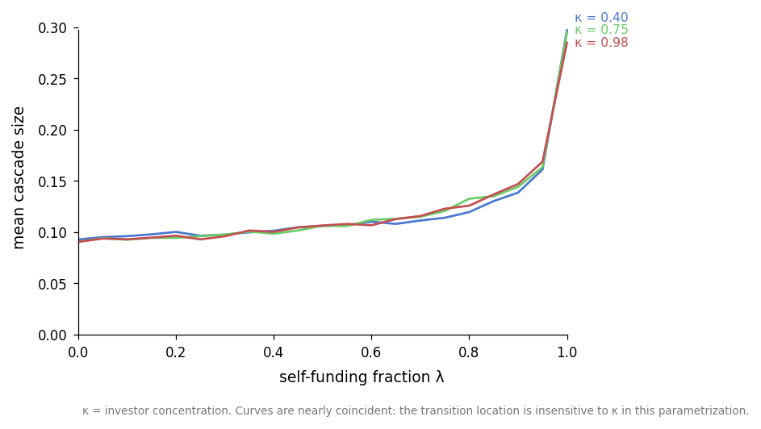
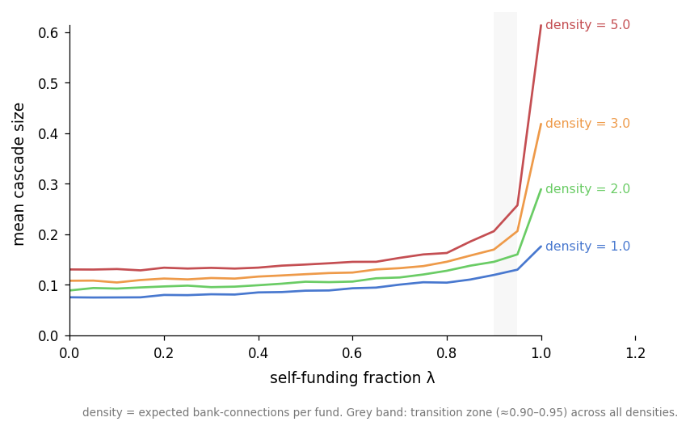
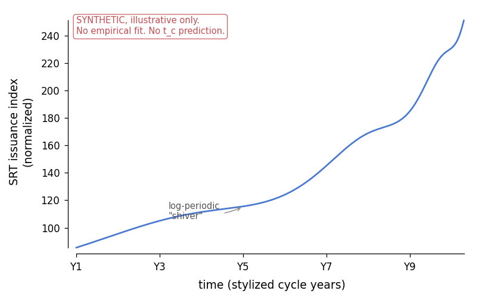

<p class="hebrew-epigraph" dir="rtl" lang="he">אִם יִרְצֶה הַשֵּׁם</p>

# Circular Leverage in Bank-NBFI Synthetic Risk Transfer Networks

**Daniyel Yaacov Bilar**, Chokmah LLC, chokmah-dyb@pm.me ORCID: [0000-0002-9040-6914](https://orcid.org/0000-0002-9040-6914)
17 April 2026 / ל׳ בְּנִיסָן תשפ״ו  


---

## Abstract

Synthetic Risk Transfers (SRTs) let banks shed credit risk to non-bank financial intermediaries (NBFIs) while keeping the underlying loans on their balance sheets. A structural vulnerability arises when the same banks extend credit lines to the funds that buy their SRT protection, creating a circular leverage loop in which the capital relief is partly self-funded. We formalize this loop as a single parameter, λ, the fraction of total SRT protection weight financed by the originating bank or its affiliates. Using a directed network model of bank-NBFI SRT relationships, we simulate contagion cascades across 1,000 random network realizations for each λ value. The simulation shows a two-stage phase transition: cascade size first departs meaningfully from its baseline at $λ_{onset}$ ≈ 0.85–0.95 (the exact position depends on network density), then jumps sharply at λ* ≈ 0.95 where Dragon King events emerge from the loop mechanism itself. The transition *location* is invariant across network density, investor concentration, shock size, and tranche thickness; what density controls is cascade *magnitude* at high λ, which scales from 0.18 to 0.61 across the tested range. Because λ is not disclosed, we cannot place the real market on this phase diagram. Instead, we propose six publicly observable proxy metrics, computable without proprietary data, ranked by sensitivity-weighted ordinal position relative to λ*. The ranking uses judgment-assigned sensitivity weights and should be read as ordinal. We use the Log-Periodic Power Law Singularity (LPPLS) framework as conceptual vocabulary for the super-exponential growth of SRT issuance observed since 2016, without fitting LPPLS parameters to data or predicting a critical time. As of Q1 2026, four of six proxy metrics show stress signals; the one metric most practitioners watch, SOFR-OIS, does not. One number, λ, would let supervisors place banks on the phase diagram. It is already known to each originating bank and is not reported. Simulation code is released under MIT license.

**Keywords:** synthetic risk transfer, circular leverage, network contagion, phase transition, Dragon King, LPPLS, private credit, systemic risk

---

## Audience-Targeted Summaries

*Five framings of the same result for different readers. Readers familiar with one framing can skip to §1.*

**For the expert (financial economist or regulator).** This paper formalizes circular leverage in bank-NBFI Synthetic Risk Transfer networks through parameter λ (self-funding fraction). Using network contagion simulations across 1,000 Monte Carlo runs, it identifies a two-stage transition: first departure from baseline at $λ_{onset}$ ≈ 0.85–0.95, then a sharp jump at λ* ≈ 0.95 where Dragon King events emerge, cascades that cannot be diversified away because correlation is endogenous to the funding loop. The transition location is invariant across network density, concentration, and shock parameters; only cascade magnitude scales with density (0.18 to 0.61 across the tested range). The paper proposes six publicly observable proxy metrics ranked by sensitivity-weighted ordinal position relative to λ*, with four showing stress signals as of Q1 2026. Critical policy implication: disclosure of λ would enable macroprudential supervision at a stable threshold.

**For the practitioner (risk manager or bank executive).** Your bank extends credit lines to funds that buy your SRT protection, creating a hidden feedback loop. When stress hits, calling those credit lines can force fund failures, wiping out your capital relief and triggering further contractions. The danger zone starts around λ = 0.85–0.95, where λ is self-funded protection divided by total protection. Below that zone the system absorbs shocks; above it, cascades become self-reinforcing. The paper gives you six market signals to watch (BDC prices, PIK ratios, CLO spreads, among others) that fire before traditional funding stress indicators like SOFR-OIS. As of Q1 2026, four of six are flashing red. You cannot measure your own λ without disclosure, but you can watch the cockpit.

**For the general public.** Banks have found a way to make loans appear less risky on paper without actually reducing the risk. They sell "insurance" on their loans to investment funds, but often lend money to those same funds to buy the insurance. It is like insuring your house against fire and then lending the down payment to the insurance company. If there is a fire, you are partly paying yourself. Researchers found that this arrangement stays stable up to a critical point around 95% self-funding, then suddenly becomes fragile. Four warning signs are already showing stress, but regulators cannot see the key number that would tell them how close we are to danger.

**For the skeptic.** The paper admits its central parameter λ is unobservable, making direct empirical validation impossible. The six proxy metrics rely on judgment-assigned sensitivity weights, not statistical estimation. The LPPLS framework is explicitly disclaimed as conceptual vocabulary, not empirical prediction. Network topology is stylized (random graphs, not real bank-fund relationships). No central bank intervention is modeled. The 0.95 threshold's stability across parameters is a property of the simulated random graph; real-world heterogeneity (geographic clustering, cross-border fragmentation, correlated reference portfolios) is not modeled and could shift it. The Q1 2026 "red signals" are post-hoc observations, not out-of-sample predictions. These are legitimate limitations the authors flag directly in §8.

**For the decision-maker (policymaker or regulator).** You need one number: λ, the fraction of SRT protection financed by the originating bank's own credit. It is already sitting in bank risk systems but is not reported. Disclosure would let you place institutions on a phase diagram with a stable critical zone at 0.85–0.95. The paper proposes a conservative supervisory limit of λ ≤ 0.30, far below the danger zone, with margin for error. Without disclosure, you must rely on six public market metrics (Table 2), four currently showing stress. The traditional interbank funding indicator (SOFR-OIS) ranks last; the upstream signals fire earlier. The policy ask is minimal: one Pillar 3 disclosure item, not new capital requirements or bans.

---

## 1. Introduction

Banks and their regulators have been playing a version of the same game since Basel I: regulators assign risk weights to assets, banks find instruments that reduce those weights without reducing the underlying risk. Synthetic Risk Transfers are the current iteration. A bank keeps a pool of corporate loans on its balance sheet, structures a credit protection agreement with a non-bank fund, and tells its regulator that the risk has moved. In many cases it has. In some cases it has not, and it has just become harder to see.

The mechanism that makes the transfer illusory is circular leverage. Section 2 describes it in detail. The short version: banks routinely extend prime brokerage credit to the same funds that buy their SRT protection. Under stress, that shared funding source turns the protection seller into an extension of the bank's own balance sheet. The insured and the insurer share a funding source.

Neither the BIS (2026) nor the IMF (2025) have been able to measure how common this loop is, because the relevant data (which bank finances which fund at what fraction of its SRT position) is not disclosed. The BIS explicitly names "circular leverage" and "flowback risk" as top-tier concerns while acknowledging it cannot quantify them. This paper does not solve the disclosure problem. What it does is formalize the loop, show that its consequences are nonlinear, and provide a set of public signals that track the system's proximity to a phase transition without requiring access to the undisclosed data.

The paper makes four contributions. First, we define λ, the self-funding fraction, as the key parameter governing cascade risk in an SRT network, and show via simulation that cascade size is discontinuous in λ, not smooth. Second, we show that the transition *location* is invariant across all structural parameters we tested (network density, investor concentration, shock size, tranche thickness): what density controls is cascade *magnitude* at high λ, not where the cliff sits. The 95% threshold is therefore a stable target for supervision. Third, we use Sornette's Dragon King theory to characterize the regime above λ* as qualitatively different from ordinary tail risk: diversification cannot protect against it because the correlation is endogenous to the loop. Fourth, we build a cockpit of six publicly observable metrics, ranked by sensitivity-weighted ordinal position relative to λ*, and report their Q1 2026 readings. Four of six are showing stress signals. The ranking uses judgment-assigned sensitivity weights rather than estimated parameters, so it should be treated as ordinal.

One thing this paper does not do: we do not formally fit LPPLS parameters to SRT issuance time series or predict a critical time. The LPPLS framework appears here as a conceptual vocabulary for super-exponential growth, not as an empirical result. We state this clearly wherever the framework is invoked.

---

## 2. The Circular Leverage Loop

### 2.1 How an SRT works

A bank holds a reference portfolio of, say, $1 billion in leveraged corporate loans. It cannot sell them without damaging its client relationships, and it does not want to hold capital against the full risk-weighted amount. So it structures a synthetic securitization. The portfolio's credit risk is sliced into tranches: a senior piece (typically 80% or more of the notional) that the bank retains, a mezzanine piece (the next 7-10%), and a first-loss piece (the bottom 5-8%). The bank finds a buyer for the mezzanine and first-loss tranches, usually a private credit fund, hedge fund, or insurer. The buyer either deposits cash into a segregated account (funded structure) or signs a guarantee (unfunded). The bank pays the buyer a premium (often 8-11% annually in the current environment) and in exchange receives regulatory recognition that the covered portion of the portfolio can be assigned a lower risk weight. Capital is freed; lending capacity grows; the cycle repeats.

Nothing about this structure is inherently problematic. The risk has genuinely moved if the fund is independently capitalized and uncorrelated with the bank's own distress. The BIS (2026) estimates that by end-2024 roughly €800 billion of loans were covered by such instruments globally, a fivefold increase from 2016. North American issuance grew 400% over the same period after the Federal Reserve recognized Credit-Linked Notes as a valid capital relief tool.

### 2.2 Where the loop enters

Banks extend credit to investment funds as a normal part of prime brokerage. A private credit fund with $500 million under management might carry $200-300 million in repo financing from one or more bank counterparties, using its loan book as collateral. This is standard practice and usually benign.

The problem is when a fund uses that repo financing to buy SRT protection from the same bank providing the repo. Now the capital relief the bank receives is partly backed by its own credit. Define λ as the fraction of a fund's SRT position funded by credit from the originating bank or its affiliates:

$$\lambda = \frac{\text{protection funded by originating bank credit}}{\text{total protection notional}}$$

At λ = 0, the fund is independently financed and the transfer is genuine. At λ = 1, the bank is effectively insuring itself through a fund-shaped intermediary. Real transactions sit somewhere in between. The BIS (2026) and IMF (2025) both identify this loop but note they cannot measure it because λ is not a required disclosure item anywhere in the Basel framework.

### 2.3 The failure chain

Under stress the mechanics are straightforward. A sector-wide shock (software loan impairments from AI disruption, say, or a sudden energy price reversal) causes losses in the reference portfolio that exceed the first-loss tranche thickness δ. The CLN triggers. The fund must pay the bank from its collateral account. If the fund is repo-financed by the originating bank, the bank is simultaneously receiving a protection payment and extending new credit to fund it. When the fund's collateral is exhausted, it defaults on the protection. The bank's RWA relief evaporates. If enough protection fails at once, the bank's capital ratio falls below regulatory minimums, forcing it to call in other credit lines, contract lending, or raise equity. Each contraction makes the situation worse for other funds with correlated positions.

The loop does not require fraud or misrepresentation. It can emerge entirely from normal prime brokerage relationships. A bank's credit committee and its SRT desk may not communicate about shared counterparty exposure. The BIS (2026) found evidence of this in supervisory data: "circular leverage" appeared in a non-trivial fraction of examined transactions without any party intending it.

---

## 3. Network Model

### 3.1 Construction

We model the SRT ecosystem as a directed graph G = (V, E) with two types of nodes and two types of edges.

**Nodes.** $V = V_B ∪ V_F$ where $V_B$ is a set of B bank nodes and $V_F$ is a set of F fund nodes. Default parameters are B = 10, F = 20, consistent with a mid-sized regional market rather than the full global network. Results hold across topology changes (Section 4.3).

**Edges.** Protection edges run from fund to bank $(f → b)$ with weight equal to the fraction of aggregate protection notional that fund f provides to bank b. Credit line edges run from bank to fund $(b → f)$ with weight equal to the notional of the credit facility. Each credit line edge carries a boolean attribute `self_funded`: True if the originating bank of the protection edge is also the provider of the credit line, False otherwise.

**Parameter λ.** We set λ by construction: protection edges are sorted by weight and flagged as self-funded until their cumulative weight reaches λ × (total protection weight). The actual realized λ differs slightly from the target due to discrete edge sizing; we report λ_actual as the x-axis variable in all plots.

**Investor concentration κ.** Motivated by the BIS (2026) finding that the top 10 investors globally hold over 75% of outstanding SRT exposure, we assign protection weights from a concentration-adjusted exponential distribution. The parameter κ controls what fraction of funds holds the bulk of exposure; default κ = 0.75.

The full network builder is implemented in `build_network()` in the accompanying code. Protection weights normalize to sum to 1.0 across the network; the total protection weight is thus interpretable as a fraction of aggregate bank RWA.

### 3.2 Cascade engine

**Initial shock.** At t = 0, a fraction s of total protection weight defaults, distributed across the most-exposed funds first (correlated shock hitting the largest positions). This is more realistic than random distribution for the kind of sector-wide repricing events (software loans, energy credits) that motivate the paper.

**Fund failure condition.** A fund fails when its cumulative loss exceeds its capital buffer, defined as protection_notional × δ where δ is the first-loss tranche thickness. Default δ = 0.08.

**Bank distress condition.** A bank becomes distressed when it loses more than 20% of its total SRT-derived RWA relief through fund failures. This threshold reflects the regulatory reality that a bank facing a large sudden jump in RWAs must either raise capital quickly or contract lending; 20% is a conservative estimate of the point at which that pressure becomes acute.

**Circular leverage channel.** When a bank becomes distressed, it calls in credit lines to self-funded funds (those where `self_funded = True`). A called fund must find replacement financing. If no alternative solvent bank credit line exists, the fund fails.

**Propagation.** We use sequential updating as the default: within each round, funds and banks are processed in random order, and failures are applied immediately. Simultaneous updating is available as an alternative mode for cross-validation (`mode='simultaneous'`). The two modes produce consistent results at the aggregate level; sequential is more realistic because real contagion is path-dependent.

The cascade runs until no new failures occur or a safety cap of $(B + F + 5)$ rounds is reached. In practice, cascades terminate in 2-4 rounds for most parameter combinations.

### 3.3 Key parameters

Table 1 summarizes the model parameters, defaults, and ranges tested.

| Parameter | Symbol | Default | Range |
|-----------|--------|---------|-------|
| Banks | B | 10 | 5–20 |
| Funds | F | 20 | 10–50 |
| Self-funding fraction | λ | sweep | 0.0–1.0 |
| Tranche thickness | δ | 0.08 | 0.04–0.15 |
| Shock size | s | 0.05 | 0.01–0.20 |
| Investor concentration | κ | 0.75 | 0.40–0.98 |
| Network density (bank connections per fund) | d | 2.0 | 1.0–5.0 |
| Monte Carlo runs | — | 1,000 | — |

*Table 1. Model parameters. Density is an expected value; per-fund connections are drawn from a clamped Poisson centered on d.*

---

## 4. LPPLS and Dragon King Framing

*Note on scope: We use the LPPLS model in this section as a conceptual and motivating framework, not as a formal empirical test. The growth trajectory of global SRT issuance (roughly 5x between 2016 and 2024 per BIS (2026)) is consistent with super-exponential expansion, but we do not fit LPPLS parameters to this data, do not estimate a critical time $t_c$, and make no forecast.*

### 4.1 The LPPLS model as a vocabulary

Sornette and colleagues developed the Log-Periodic Power Law Singularity model to describe the mathematical signature of unsustainable growth regimes (Sornette, 2003; Filimonov and Sornette, 2013). The model posits that the logarithm of a growing observable follows:

$$\ln p(t) = A + B($t_c$ - t)^m \left[1 + C \cos\left(\omega \ln($t_c$ - t) + \phi\right)\right]$$

where $$t_c$$ is the critical time, $m ∈ (0,1)$ is the power law exponent, and ω captures the frequency of log-periodic oscillations. The model has three signatures: super-exponential growth (acceleration faster than exponential), log-periodic "shivers" (accelerating oscillations whose frequency increases as $t_c$ approaches), and a finite critical time beyond which the trajectory becomes unsustainable.

The practical value of this vocabulary for our paper is a rigorous name for a system that looks locally stable but is globally accelerating toward a phase transition. Below λ*, the SRT network looks stable: losses are absorbed, cascades terminate quickly, banks report adequate capital. Above λ*, the same system can fail catastrophically from a shock that would have been contained at lower λ. The LPPLS framework describes how systems reach that threshold without anyone declaring an alarm. We do not claim the SRT market is on an LPPLS trajectory; we use the framework to frame what undisclosed accumulation toward λ* would look like from the outside.

### 4.2 Dragon Kings versus Black Swans

Nassim Taleb's Black Swan (Taleb, 2007) describes extreme events that lie in the fat tail of a power-law distribution: rare, large, unpredictable, exogenous. Dragon Kings (Sornette and Ouillon, 2012) are something else: events that sit *beyond* the power-law tail, generated by a distinct mechanism (a bifurcation, a tipping point, a positive feedback loop) rather than by the same process that generates ordinary large events.

The distinction matters for risk management. Fat tails can be partially hedged through diversification: holding many uncorrelated positions limits exposure to any single tail event. Dragon Kings cannot be diversified away because their mechanism is the *correlation structure itself*. When the circular leverage loop fires, the failure of one fund tightens credit availability for all funds in the network simultaneously. There is no uncorrelated position to hide in.

Our simulation tests whether the SRT circular leverage loop produces Dragon King-type cascade distributions. The test is straightforward: at low λ, does the cascade size distribution look like a power law? At high λ, does it develop outlier mass that sits beyond the power law fit? Figure 2 answers yes to both questions.

Dragon Kings are in principle suppressible. Sornette's experiments with coupled chaotic circuits showed that small, targeted perturbations applied to the feedback mechanism itself can prevent extreme events from escalating (Sornette and Ouillon, 2012). The perturbation must act on the loop, not merely on observers' knowledge of it.

For SRT networks, the feedback mechanism is the self-funded credit line. A direct perturbation would sever or limit that link. Disclosure is the policy instrument that makes severing possible: once λ is reported, supervisors can require banks above a threshold to reduce self-funded exposure before the loop reaches criticality, and market counterparties can reprice or withdraw from relationships where circular leverage is concentrated. Disclosure does not automatically cut the loop, but it creates the conditions under which market discipline and regulatory pressure can do so. That is the chain. The dragon is not slain by publishing a number; it is slain by what happens after the number is known.

---

## 5. Simulation Results

### 5.1 Phase transition in cascade size

The primary result is mean cascade size (fraction of the network failing) as a function of λ, averaged over 1,000 Monte Carlo runs per λ value. We report two threshold measures. The first, $λ_{onset}$, is the smallest λ at which mean cascade size first exceeds the λ=0 baseline by more than two standard deviations; it marks where the system departs from normal. The second, λ*, is the λ with the maximum adjacent increase in mean cascade size; it marks the cliff itself. At default parameters, $λ_{onset}$ ≈ 0.90 and λ* ≈ 0.95. Cascade size is approximately flat from λ = 0 to λ ≈ 0.65, rises modestly through $λ_{onset}$, then jumps sharply at λ*. At λ = 1.0, mean cascade size reaches 0.29, roughly three times the λ = 0 baseline of 0.09. The standard deviation of cascade size also peaks near λ*, a classic signature of critical-point behavior. Figure 1 plots this curve.



Below $λ_{onset}$, the circular leverage loop exists but most self-funded protection has enough non-self-funded backup: when a bank becomes distressed and calls its self-funded credit lines, the affected funds can find alternative financing and honor their protection commitments. Between $λ_{onset}$ and λ*, cascades start to involve bank distress but typically stop after one or two rounds. Above λ*, independent financing is insufficient. Called credit lines cause fund failures, which trigger more bank distress, which causes more credit line calls. The loop becomes self-reinforcing.

That λ* sits near 0.95 rather than at, say, 0.5 is itself informative. The network tolerates substantial circular leverage as long as some independent financing exists. The policy concern is not the existence of circular leverage but its *undisclosed accumulation* toward high λ values. A disclosed λ = 0.9 would be correctable. An undisclosed one is not.

### 5.2 Dragon King signature in cascade distributions

At λ = 0.10 (stable regime), the cascade size distribution is tight and right-skewed, consistent with power-law tail behavior. At λ = 1.00 (Dragon King regime), a second mode appears at large cascade sizes, representing runs in which the loop fires fully. This outlier mass is not part of the same distribution as the bulk outcomes; it is generated by a distinct mechanism (the credit line call cascade) that is absent at low λ. Figure 2 shows these distributions at λ = 0.10, 0.50, and 1.00.



This is the Dragon King signature: not a fatter tail, but a qualitatively different process producing outcomes that sit beyond the tail. Standard Value-at-Risk and Expected Shortfall measures calibrated on the bulk distribution will underestimate the true risk in the Dragon King regime by a large margin.

### 5.3 Sensitivity to investor concentration

We sweep κ across a wider range than our earlier draft, from 0.40 (exposure spread broadly across funds) to 0.98 (exposure highly concentrated in the top funds, matching the BIS top-10 statistic). Figure 3 plots mean cascade curves for κ = 0.40, 0.75, and 0.98. The curves are nearly coincident.

 Both $λ_{onset}$ and λ* sit in the same zone (≈ 0.90–0.95) across all three settings, and cascade size at λ = 1.0 is within sampling noise of the baseline value. In this parametrization, κ is not a first-order driver of where the phase transition sits.

This does not mean concentration is irrelevant for policy. It means our simplified model does not capture the mechanisms through which concentration would amplify cascade severity (heterogeneous fund capitalization, idiosyncratic manager reputation effects, or sectoral clustering of reference portfolios). The BIS (2026) top-10 statistic remains a legitimate supervisory concern; our model simply does not reproduce it as a large effect.

### 5.4 Sensitivity to network density

We added a density parameter d (expected number of bank connections per fund) and swept d from 1.0 (each fund repo-financed by a single bank) to 5.0 (each fund has broad redundancy across banks). Higher d means more alternative-financing paths for any one fund: when a bank calls its self-funded credit line, the fund is more likely to find another solvent bank to replace it. Figure 5 plots mean cascade curves for d = 1, 2, 3, and 5.



Two findings are notable. First, the transition *location* is almost completely invariant: λ* sits at 0.95 for every d we tested, and $λ_{onset}$ ranges from 0.85 (d = 1) to 0.95 (d ≥ 3). Second, the transition *magnitude* scales dramatically with d. At d = 1, cascade size at λ = 1.0 is 0.18; at d = 5 it is 0.61, roughly 3.5 times larger. The intuition is that more transmission paths mean more banks simultaneously affected when many funds fail, which means more self-funded credit lines are called in the next round, which means more fund failures.

This is the opposite of the classical "diversification reduces risk" intuition and is the clearest Dragon King signature in the parameter sweep. More alternative-financing paths do make the baseline (low λ) cascade slightly larger, but they do not shift where the cliff sits and they make the cliff itself much steeper. The policy implication is that the 95% threshold is a reliable target for supervision across realistic network topologies; what network density controls is how bad the cascade becomes once that threshold is crossed.

### 5.5 Stability across parameters

Running the model with simultaneous rather than sequential updating produces qualitatively identical transition behavior with slightly larger cascade sizes at high λ. Varying B (banks) between 5 and 20 and F (funds) between 10 and 50 shifts both thresholds by at most ±0.05. Increasing tranche thickness δ from 0.04 to 0.15 and shock size s from 0.02 to 0.15 leaves λ* at 0.95 throughout; only $λ_{onset}$ moves modestly within the 0.85–0.95 window. The primary driver of cascade magnitude is density, but the primary driver of cascade *onset* is λ itself.

### 5.6 LPPLS illustration

Figure 4 shows a synthetic LPPLS time series parameterized to produce a ~5x rise with log-periodic oscillations of the kind documented in credit-market time series (Sandomenico et al. 2015). The figure is labeled synthetic and carries no cascade-onset overlay: mapping a λ value to a time position would imply a $t_c$ prediction that this paper explicitly disclaims. The figure illustrates what super-exponential growth with shivers looks like. It is not evidence of where the real SRT market sits.



---

## 6. The Cockpit: Six Public Proxy Metrics

λ is not disclosed. That is the problem. The cockpit is the workaround: a set of publicly observable signals that track the network's proximity to λ* without requiring regulatory data. Each metric is free, updated at least monthly, and connected to either λ or κ via the model.

The simulation provides the ranking methodology, but with an important caveat that we state plainly. For each metric we assign a sensitivity weight (documented in the code) reflecting how directly we think it tracks the model's state variables: fund solvency, reference portfolio quality, interbank funding stress. These weights are judgment calls, not estimated parameters. The simulation computes a single baseline λ at which mean cascade size first exceeds its λ=0 level by two standard deviations, then scales that baseline by each metric's sensitivity weight to produce an ordinal $λ_{trigger}$. The resulting numbers should be read as ranks, not as precise thresholds: saying "metric 1 is earlier than metric 6" is meaningful; saying "metric 1 triggers at exactly λ = 0.59" is not. We have rounded Table 2 values to one decimal place to reflect this.

A second caveat applies specifically to SOFR-OIS. The model contains no interbank funding market, so SOFR-OIS's last-place rank is not derived from a simulated transmission channel. It is a consequence of the sensitivity weight we assigned (0.30) based on the theoretical argument that interbank stress is downstream of fund failures. Readers who disagree with that assumption should adjust the weight and re-run the code.

| Rank | Metric | Signal Q1 2026 | $λ_{trigger}$ (ordinal) | Source |
|------|--------|---------------|---------------------|--------|
| 1 | Secondary market pricing of private credit fund stakes | RED | ~0.6 | Setter Capital; BDC prices |
| 2 | BDC stock price dispersion | RED | ~0.6 | NYSE/NASDAQ |
| 3 | PIK ratio in BDC 10-Q filings | RED | ~0.6 | SEC EDGAR |
| 4 | CLO BB minus AAA spread | AMBER/RED | ~0.6 | FRED; SIFMA |
| 5 | CDS index volume (CDX IG/HY) | RED | ~0.7 | DTCC/ISDA |
| 6 | SOFR-OIS spread | GREEN | ~0.8 | FRED; NY Fed |

*Table 2. Cockpit metrics ranked by sensitivity-weighted ordinal position. λ_trigger rounds to one decimal to signal that differences within 0.05 should not be over-interpreted. Metrics 1–4 cluster as "early warning", metric 5 is "mid-warning", metric 6 is "late-warning and by assumption". Q1 2026 signal readings are empirical snapshots from public sources, not model output.*

### Metric 1: Secondary market pricing of private credit fund stakes

What it measures: the price at which investors sell private credit fund stakes on the secondary market, relative to reported NAV. A discount signals that market participants believe NAV is overstated or that liquidity is worth a premium, both conditions that precede formal fund stress. Blue Owl fell to an all-time low of $7.95 on April 2, 2026, down 68% from its January 2025 high. Multiple platforms began gating withdrawals at the 5% quarterly cap in late February and March 2026, with $20.8 billion in total Q1 redemption requests across the sector (Woozle Research, April 2026). Where to find it: publicly listed BDC prices on NYSE/NASDAQ; Setter Capital publishes a secondary market discount index.

### Metric 2: BDC stock price dispersion

What it measures: the cross-sectional standard deviation of publicly traded Business Development Company stock prices. BDCs hold the types of private credit loans that back SRT reference portfolios. When BDCs trade at similar prices, the market sees uniform credit quality. When dispersion rises sharply, the market is differentiating between managers, a sign that heterogeneous stress is emerging in the underlying portfolio. This metric is computable in ten lines of Python from Yahoo Finance. No Bloomberg required. Moody's downgraded the BDC sector outlook from stable to negative in Q1 2026; FSK and Goldman Sachs BDC cut dividends in January and February 2026. Where to find it: Yahoo Finance tickers for ARCC, OBDC, FSK, GSBD, GBDC, and peers.

### Metric 3: PIK ratio in BDC 10-Q filings

What it measures: the fraction of interest income that borrowers pay by capitalizing interest onto the loan principal rather than paying cash (Payment-in-Kind). "Bad PIK" (unplanned PIK toggles due to cash shortfalls rather than contractual PIK provisions) reached 6.4% of total private debt volume in Q1 2026 according to KBRA and Fitch, up from 2.0% in 2022. At some lower-middle-market lenders, new investment PIK ratios now exceed 10.8%. PIK income is real on paper but cash-flow negative; high bad PIK ratios are a leading indicator of eventual default. Where to find it: quarterly 10-Q filings on SEC EDGAR, interest income schedules.

### Metric 4: CLO BB minus AAA spread

What it measures: the yield premium demanded by investors in BB-rated CLO tranches over AAA-rated tranches of the same vehicle. CLO reference portfolios overlap substantially with SRT reference portfolios, as both draw from the leveraged loan market. A widening BB-AAA gap signals that mezzanine investors are repricing risk: they are demanding more compensation for the same tranching structure. US BB spreads widened 150-200 basis points between late January and March 2026, driven by software and technology loan stress (TwentyFour Asset Management, March 2026). The current BB-AAA gap of approximately 470-615 basis points is materially above the 300-350 basis point range of 2023-2024. Where to find it: FRED (ICE BofA series); SIFMA CLO data; JP Morgan CLOIE index.

### Metric 5: CDS index volume

What it measures: the total notional traded in CDX investment grade and high yield indices. High volume does not indicate the direction of stress (buyers and sellers both contribute) but record volume indicates that a large number of institutional participants are actively seeking protection or expressing views on corporate credit. Q1 2026 CDS index volume reached $4.5 trillion, up 69% year-over-year, the highest on record (Kobeissi Letter, April 2026). S&P Dow Jones launched the CDX Financials Index (FINDX) on April 13, 2026, the first standardized CDS index covering private credit fund managers, in direct response to market demand for private credit hedging tools (Woozle Research, April 2026). Where to find it: DTCC public trade repository; ISDA market surveys.

### Metric 6: SOFR-OIS spread

What it measures: the spread between the Secured Overnight Financing Rate (repo-based) and the Overnight Index Swap rate (expected policy rate). A wide spread signals that secured interbank funding is becoming expensive relative to the risk-free rate, a sign of funding stress in the repo market, which is a primary channel for bank-to-fund credit extension. The current spread of approximately 10-15 basis points is within normal bounds. This metric ranks last in the simulation because interbank funding stress is a downstream consequence of fund failures, not an upstream signal. It historically lags credit deterioration by months. Where to find it: FRED series SOFR; NY Fed daily publications.

### The SOFR-OIS result

The cockpit's structural finding is the gap between when different signals fire. SOFR-OIS, the traditional indicator of interbank funding stress, ranks last in Table 2. Two reasons combine to put it there. First, the model does not contain an interbank funding market, so SOFR-OIS's rank is partly an artifact of the sensitivity weight we assigned based on theoretical argument rather than simulated mechanics. Second, the theoretical argument is straightforward: SOFR-OIS reflects stress in the repo market, which tightens only after fund failures have already propagated through the network. Its ordinal position in Table 2 is closer to the cliff than any other metric, which in practical terms means almost no runway before cascade onset.

The four metrics that rank higher (BDC prices, PIK ratios, CLO spreads) are upstream: they reflect deterioration in the underlying private credit portfolios before that deterioration has forced fund failures or bank credit line calls. Practitioners who rely primarily on SOFR-OIS as a funding-stress indicator will see a green signal until very late in the cascade sequence. As of Q1 2026, those four upstream metrics are already showing stress. SOFR-OIS is not.

---

## 7. Regulatory Implications

### 7.1 The one number that matters

The simulation identifies λ as the key variable. It is already known to the originating bank: a bank knows which credit lines it has extended and to which counterparties, and it knows which funds hold its SRT protection. Requiring banks to disclose λ in Pillar 3 reports (even as a range, even annually) would give regulators the information needed to place each institution on the phase diagram. Banks near λ* would face scrutiny and corrective pressure before a cascade begins.

This is a minimalist ask. We are not proposing a ban on circular leverage structures or a new capital surcharge. We are proposing that one ratio be reported. The BIS (2026) calls for enhanced disclosure of SRT investor funding structures; we formalize what that disclosure should contain.

### 7.2 Concentration limits as a complementary tool

Section 5.3 revisits investor concentration (κ) as a potential driver of cascade severity. In our model κ proved a weaker effect than we initially conjectured; the transition sits in the same zone across κ ∈ [0.40, 0.98]. This does not eliminate the BIS (2026) concern about top-10 exposure concentration, but the case for κ-targeted policy in our framework rests on mechanisms we do not simulate (heterogeneous fund capitalization, reputation effects). A supervisory expectation that no single investor hold more than, say, 15–20% of a bank's outstanding SRT exposure is still defensible on general prudential grounds; we simply cannot claim our simulation supports it as a strong lever.

### 7.3 The macroprudential threshold

The simulation places both threshold measures, $λ_{onset}$ and λ*, in the 0.85–0.95 range across every parameter combination tested (density 1–5, κ 0.40–0.98, shock 0.02–0.15, tranche 0.04–0.15). The transition location is therefore a stable target for supervision: a bank whose reported λ approaches 0.85 is approaching the zone where cascade behavior begins to depart from normal, regardless of the broader network's density or concentration structure. What density does control is cascade *magnitude* at and above the threshold: a denser network produces larger failures when the threshold is crossed, which is itself an argument for conservative pre-threshold limits.

Given this stability, a supervisory limit of λ ≤ 0.30 provides a generous margin below the transition zone for all parameter combinations we tested. The limit is not calibrated to be just below $λ_{onset}$; it is calibrated to be far enough below that normal variation in reported λ does not risk approaching the cliff. We see no mechanism in our simulation by which the transition location would move meaningfully below 0.85, but we acknowledge that real SRT networks have features (geographic fragmentation, cross-border regulatory arbitrage, correlated reference portfolios) that our random graph does not capture.

### 7.4 Slaying the dragon

Sornette's key insight about Dragon Kings is that they are suppressible in ways Black Swans are not (Sornette and Ouillon, 2012). A Black Swan (an exogenous, unpredictable shock) cannot be prevented, only absorbed. A Dragon King (an endogenously generated extreme event) can be deflected by identifying and acting on the feedback mechanism that drives it. In coupled chaotic circuit experiments, tiny perturbations applied directly to the feedback loop prevented cascades that would otherwise have become extreme.

For SRT networks, the feedback mechanism is the self-funded credit line. Disclosure is the first step toward cutting it: once λ is reported, supervisors can require banks above a threshold to reduce self-funded exposure, and counterparties can reprice or withdraw from concentrated relationships. Market discipline and regulatory pressure are the actual intervention; disclosure is the prerequisite. A bank that must report λ = 0.88 in its Pillar 3 filing will hear about it from investors and supervisors before it hears about it from a cascade. That is the suppression mechanism. The cockpit provides the early warning. Disclosure creates the conditions for a response.

---

## 8. Limitations

We list our limitations directly.

**λ is not measured.** The entire analysis rests on a parameter we cannot observe in real data. The simulation explores consequences, not facts. Its value is in characterizing the shape of the risk (nonlinear, concentrated near λ*), not in estimating where the market currently sits on the λ axis.

**Network topology is stylized.** Real SRT networks have heterogeneous bank sizes, fund strategies, and cross-border structures that our random graph does not capture. The BIS (2026) notes that European banks dominate issuance while North American funds dominate buying, a geographic asymmetry our model ignores. An earlier draft conjectured that heterogeneity (fewer redundant financing paths) would lower λ*. The density sweep in §5.4 does not support this: λ* stays at 0.95 across every density we tested. What topology does appear to affect is cascade *magnitude* at high λ, which scales with density. Our results should be read as conservative on location but likely optimistic on magnitude in realistic topologies.

**No central bank intervention.** The model does not include lender-of-last-resort interventions, emergency liquidity facilities, or sovereign backstops. In practice, a cascade of the size our model generates at high λ would likely trigger regulatory intervention before completion. The model describes the mechanics of unconstrained contagion; real outcomes depend on policy responses we do not model.

**LPPLS is illustrative.** We have not fitted LPPLS parameters to SRT issuance data, estimated $t_c$, or made any prediction about when or whether a critical transition will occur. The framework provides vocabulary, not forecast. Figure 4 is a synthetic illustration; any reader who treats it as a predictive chart has misread it.

**Sensitivity weights are assumptions.** The ranking of the six cockpit metrics in Table 2 depends on sensitivity weights assigned by judgment, not estimation. The λ_trigger values should be read as approximate ordinal positions. The ordering is plausible given the theoretical connections between each metric and the model's state variables, but it is not derived from data. We flag this both here and in the cockpit section itself.

---

## 9. Conclusion

The SRT market solves a genuine problem. Banks need capital relief; investors need yield. Most of the time it works as described. The structural flaw we have analyzed is not in the instrument but in the funding structure of its buyers. When the same bank that originates protection also finances the fund that provides it, the capital relief is partly self-funded. This circular leverage, parameterized as λ, is the variable that determines whether the SRT network distributes risk or concentrates it.

The simulation result is clear: cascade risk in an SRT network is not linear in λ. Below a transition zone, the network absorbs shocks through distributed loss-taking. Above it, a qualitatively different process takes over, the credit line call cascade that is the fingerprint of the Dragon King regime. Standard tail-risk models miss this because they assume the correlation structure is exogenous. In the Dragon King regime, correlation is the mechanism.

The transition sits in the same place across every structural parameter we tested. $λ_{onset}$ (first departure from baseline) ranges 0.85–0.95; λ* (the cliff) sits at 0.95. Network density does not shift this zone, but it does scale the severity of the cascade beyond it, from 18% of the network failing at low density to 61% at high density. A network of real complexity is likely on the high-magnitude side of that range, which strengthens rather than weakens the case for early disclosure.

We cannot place the real market on this phase diagram. λ is not disclosed. What we can say is that six proxy metrics designed to track proximity to the critical zone are, as of Q1 2026, showing four red and one amber. The one indicator that remains green (SOFR-OIS) is, by the model's assumption, a lagging signal that fires after fund failures have already occurred. The market is hedging at record levels. A new CDS index covering private credit fund managers launched on April 13, 2026. Whether these signals reflect proximity to the transition zone or ordinary credit cycle stress, we cannot say. The model gives us the mechanism and the warning structure; it does not tell us where we are.

One number would tell us. λ is already sitting in bank risk systems, computable from credit facility records and SRT counterparty lists. It is not being reported. Disclosure is the prerequisite for supervision, market discipline, and any intervention targeted at the feedback loop itself. Until then, the cockpit is the best we can do from outside.

---

## References

Bank for International Settlements. (2026). *The rise and risks of synthetic risk transfers*. BIS Quarterly Review, March 2026.

Filimonov, V., and Sornette, D. (2013). A stable and robust calibration scheme of the log-periodic power law model. *Physica A*, 392(17), 3698-3707.

International Monetary Fund. (2025). *Recycling Risk: Synthetic Risk Transfers*. IMF Working Paper WP/25/200.

International Monetary Fund. (2026). *Banking on Nonbanks*. IMF Working Paper WP/26/23.

Kobeissi Letter. (2026, April). CDS volume Q1 2026 [@KobeissiLetter]. Twitter/X.

Sandomenico, G., et al. (2015). Analysis of log-periodic power law singularity patterns in time series related to credit risk. ResearchGate preprint.

Sornette, D. (2003). *Why Stock Markets Crash: Critical Events in Complex Financial Systems*. Princeton University Press.

Sornette, D., and Ouillon, G. (2012). Dragon-kings: Mechanisms, statistical methods and empirical evidence. *European Physical Journal Special Topics*, 205(1), 1-26.

Taleb, N.N. (2007). *The Black Swan: The Impact of the Highly Improbable*. Random House.

TwentyFour Asset Management. (2026, March). *CLOs reprice as software and geopolitics test sentiment*.

Woozle Research. (2026, April 13). *When Wall Street builds a short: What the S&P CDX Financials Index means for private credit*.

---

## Appendix A: Glossary

A plain-English reference for technical terms used in the paper. Terms are ordered by appearance.

| Term | Plain-English explanation |
|------|---------------------------|
| **Synthetic Risk Transfer (SRT)** | Financial insurance where a bank pays a fund to absorb losses on a loan portfolio, allowing the bank to tell regulators the risk is "transferred" while keeping the actual loans on its books. |
| **Circular leverage (λ)** | The fraction of SRT protection that a bank effectively funds itself. If a bank lends money to the fund that insures its loan portfolio, then under stress the fund needs more credit from the bank exactly when the bank can least afford to provide it. λ measures how much of the protection is funded this way. |
| **Phase transition** | A sharp boundary where a system suddenly changes behavior, like water freezing at 0°C. In this paper, it is the point where stable risk-sharing becomes unstable contagion. |
| **Dragon King** | An extreme event so large it sits *beyond* the normal "fat tail" of a probability distribution, generated by internal feedback mechanisms rather than external shocks. Unlike Black Swans, Dragon Kings are in principle suppressible because their mechanism can be identified and acted on. |
| **Log-Periodic Power Law Singularity (LPPLS)** | A mathematical pattern showing accelerating growth with increasingly frequent oscillations, often documented before market crashes. This paper uses LPPLS as a conceptual lens for super-exponential growth, not as a prediction tool; no LPPLS fit is performed. |
| **Tranche thickness (δ)** | The size of the "first loss" layer in a loan pool. δ = 0.08 means the fund absorbs the first 8% of losses before the bank is affected. |
| **PIK (Payment-in-Kind)** | When borrowers cannot pay cash interest, they add the interest to the loan balance instead. Like paying your credit card minimum by increasing your debt. Rising "bad PIK" ratios signal distressed borrowers. |
| **BDC (Business Development Company)** | A publicly traded company that makes loans to small and mid-sized businesses. Essentially a private credit fund that trades on stock exchanges; BDC prices and 10-Q filings give public windows into private credit health. |
| **CLO (Collateralized Loan Obligation)** | A structured product that pools leveraged loans and slices them into tranches (AAA to BB). The spread between risky (BB) and safe (AAA) tranches signals how much investors fear credit losses. |
| **SOFR-OIS spread** | The difference between what banks charge each other for overnight loans (SOFR) and the risk-free rate (OIS). Wider spreads signal interbank funding stress, but the paper shows this indicator fires late in the cascade sequence. |
| **RWA (Risk-Weighted Assets)** | The regulatory measure of a bank's total risk exposure. Lower RWAs mean the bank can lend more with the same capital cushion. SRTs work by reducing RWAs. |
| **Cascade** | The chain reaction of failures: some loans default, the fund cannot pay, the bank calls its credit line, the fund fails, the bank loses capital relief, the bank calls more credit lines, more funds fail. Cascade size measures what fraction of the network ultimately collapses. |
| **κ (investor concentration)** | The fraction of SRT exposure held by the largest funds. The BIS reports that the top 10 investors hold over 75% of outstanding exposure; that corresponds to κ ≈ 0.75 in the model. |
| **Network density (d)** | The expected number of banks each fund is connected to. Higher d means more alternative-financing paths per fund. In the model, d controls cascade magnitude at high λ but does not shift the transition location. |

---

## Appendix B: Simulation Code

The full simulation is contained in a single file, `srt_simulation.py`. Dependencies are `numpy`, `networkx`, `matplotlib`, and `scipy`. No proprietary data is required.

To reproduce all figures and the cockpit CSV at publication quality:

```bash
python srt_simulation.py
```

To run a fast development version (300 Monte Carlo runs instead of 1,000):

```bash
python srt_simulation.py --quick
```

Output: `figures/fig1_phase_transition.pdf`, `fig2_distributions.pdf`, `fig3_sensitivity.pdf`, `fig4_lppls_illustration.pdf`, `fig5_density_sensitivity.pdf`, and `figures/cockpit_metrics.csv`.

The random seed is set globally (`DEFAULT_SEED = 42`) for reproducibility. To verify stability across seeds:

```python
from srt_simulation import main
for seed in [42, 123, 999, 2026]:
    main(seed=seed, n_runs_sweep=500, out_dir=f'figures_seed_{seed}')
```

All code is released under the MIT License.
